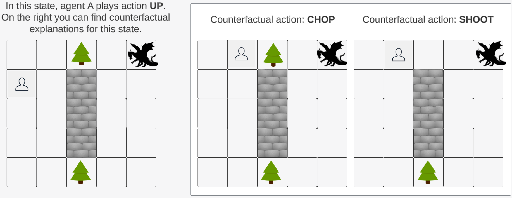

# RACCER

RACCER is an algorithm for generating counterfactual explanations for explaining reinforcement learning (RL) models. RACCER takes into account the sequential and stochastic nature of RL environments and generates counterfactuals that are easy to obtain and deliver the desired outcome with high certainty.

More information can be found in our paper: RACCER: Towards Reachable and Certain Counterfactual Explanations for Reinforcement Learning



### Requirements
```bash
python >= 3.8

```
### Installation
```bash 
git clone git@github.com:anonymous902109/RACCER.git
conda create -n raccer python=3.8
conda activate raccer
pip install -r requirements  

```

### Running Experiments


```python

python main.py

```


